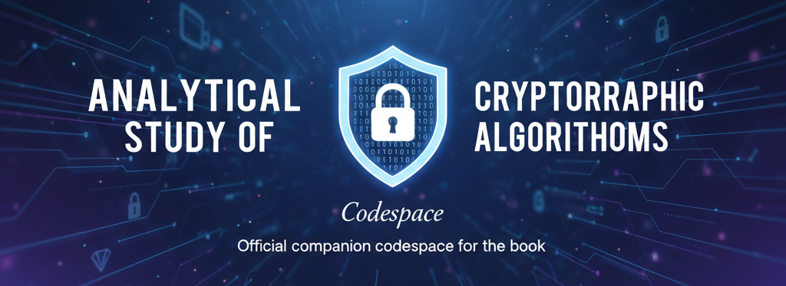

<h1 align="center">Analytical Study of Cryptographic Algorithms — Codespace</h1>
<p align="center">
  <i>Official companion codespace for the book</i>
</p>
<!--<p align="center">
  
</p>-->
<p align="center">
  
  
  
  
</p>

## 📚 Table of Contents
- [Overview](#overview)
- [Cryptographic Algorithms Covered](#cryptographic-algorithms-covered)
- [Installation](#installation-guide)
- [Folder Structure](#folder-structure)
- [License](#license)
- [Contributors](#-contributorsmaintainers)

## Overview
This the official code repository accompanying the book "Analytical Study of Cryptographic Algorithms". Contains complete implementations of all cryptographic algorithms discussed in the book, structured chapter by chapter — designed to complement the theoretical concepts with hands-on, executable code.

This repository focuses on various cryptographic algorithms, including **Symmetric Key Cryptography**, **Asymmetric Key Cryptography**, **Hashing Algorithms**, **Digital Signature Algorithm**, **Key Derivation Functions**, **Message Authentication Codes**, **Homomorphic Encryption**, and **Post-Quantum Cryptography**.


## Cryptographic Algorithms Covered

| Category | Count |
|----------|-------|
| Symmetric Algorithms | 17 |
| Asymmetric Algorithms | 8 |
| Hashing Algorithms | 12 |
| Digital Signatures | 6 |
| Key Derivation Functions | 4 |
| Message Authentication Codes | 4 |
| Homomorphic Encryption | 6 |
| Post-Quantum Algorithms | 7 |
| **Total** | **64** |

<details>
<summary>🔑 1. Symmetric-Key Cryptography</summary>

> These algorithms use the same key for both encryption and decryption.

#### 📦 1.1 Block Ciphers
> Encrypts fixed-size blocks of data

- Data Encryption Standard (**DES**)
- Triple Data Encryption Standard (**3DES**)
- Advanced Encryption Standard (**AES**)
- International Data Encryption Algorithm (**IDEA**)
- Blowfish Encryption Algorithm
- Twofish Encryption Algorithm
- Serpent Encryption Algorithm
- Camellia Encryption Algorithm
- Skipjack Encryption Algorithm
- RC5 (**Rivest Cipher 5**)
- RC6 (**Rivest Cipher 6**)

#### 🌊 1.2 Stream Ciphers
> Encrypts data bit by bit

- A5/1 and A5/2
- Rivest Cipher 4 (**RC4**)
- Software-Optimized Encryption Algorithm (**SEAL**)
- Grain Stream Cipher
- Salsa20 Stream Cipher
- ChaCha20 Stream Cipher

</details>

---

<details>
<summary>🗝️ 2. Asymmetric-Key Cryptography (Public-Key Cryptography)</summary>

> These algorithms use a pair of keys: a **public key** for encryption and a **private key** for decryption.

- RSA Algorithm
- Diffie–Hellman Algorithm
- Elliptic Curve Cryptography (**ECC**)
- ElGamal Algorithm
- Paillier Cryptosystem
- NTRUEncrypt
- Digital Signature Algorithm (**DSA**)
- Edwards-curve Digital Signature Algorithm (**EdDSA**)

</details>

---

<details>
<summary>🔍 3. Hashing Algorithms (Cryptographic Hash Functions)</summary>

> Used for verifying data integrity and authentication.

#### 📝 3.1 MD (Message Digest) Family

- MD2 (**Message Digest Algorithm 2**)
- MD4 (**Message Digest Algorithm 4**)
- MD5 (**Message Digest Algorithm 5**)

#### 🔒 3.2 SHA (Secure Hash Algorithm) Family

- SHA-1
- SHA-2
- SHA-3

#### 🧩 3.3 Other Hashing Algorithms

- RIPEMD
- Tiger Cryptographic Hash Function
- Whirlpool Hash Function
- BLAKE2 Cryptographic Hash Function
- BLAKE3 Cryptographic Hash Function
- Skein Cryptographic Hash Function

</details>

---

<details>
<summary>✍️ 4. Digital Signature Algorithms</summary>

> Used for authentication and integrity verification.

- Digital Signature Algorithm (**DSA**)
- RSA Digital Signature Algorithm
- Elliptic Curve Digital Signature Algorithm (**ECDSA**)
- Edwards-curve Digital Signature Algorithm (**EdDSA**)
- CRYSTALS-Dilithium Signature Algorithm
- Falcon Signature Algorithm

</details>

---

<details>
<summary>🧪 5. Key Derivation Functions (KDF)</summary>

> Used to generate secure cryptographic keys from passwords or other inputs.

- Argon2
- bcrypt
- PBKDF2
- scrypt

</details>

---

<details>
<summary>🛡️ 6. Message Authentication Codes (MAC)</summary>

> Used for message integrity verification.

- HMAC Algorithm
- CMAC Algorithm
- GMAC Algorithm
- Poly1305 Algorithm

</details>

---

<details>
<summary>🧮 7. Homomorphic Encryption</summary>

> Allows computation on encrypted data without decryption.

- RSA Cryptosystem
- Paillier Cryptosystem
- BGV Homomorphic Encryption
- CKKS Homomorphic Encryption
- TFHE Homomorphic Encryption
- Microsoft SEAL Homomorphic Encryption

</details>

---

<details>
<summary>⚛️ 8. Post-Quantum Cryptographic Algorithms</summary>

> Designed to resist quantum computing attacks.

- CRYSTALS-Kyber
- CRYSTALS-Dilithium
- NTRU
- FALCON
- RAINBOW
- SPHINCS+
- SIKE

</details>

---

## Installation Guide
### 1. Clone the Repository
To get a copy of this repository, run the following command:
```sh
 git clone https://github.com/ProgrammerSnehasish/Analytical_Study_of_Cryptographic_Algorithms_Codespace
 cd Analytical_Study_of_Cryptographic_Algorithms_Codespace
```

### 2. Install Python
Ensure you have **Python 3.7+** installed. If not, download and install it from:
[Python Official Website](https://www.python.org/downloads/)

### 3. Create Virtual Environment 
```bash
# Create
python -m venv venv

# Activate
venv\Scripts\activate #(For WINDOWS)
#or
source venv/bin/activate #(For Linux or MAC OS)

#Deactivate
deactivate
```
### 4. Install Required Python Modules
Install dependencies using `pip`:
```sh
 pip install -r requirements.txt
```
## Folder Structure
```bash
Analytical_Study_of_Cryptographic_Algorithms_Codespace/
│
│
├── 01_Symmetric_Key_Cryptography/
│   ├── 1.1_Block_Ciphers/
│   └── 1.2_Stream_Ciphers/
│
├── 02_Asymmetric_Key_Cryptography/
├── 03_Hashing_Algorithms/
│   ├── 3.1_MD_Family/
│   ├── 3.2_SHA_Algorithm_Family(SHA)/
│   └── 3.3_Other_Hashing_Algorithm/
│
├── 04_Digital_Signature_Algorithm/
├── 05_Key_Derivation_Functions_(KDF)/
├── 06_Message_Authentication_Codes_(MAC)/
├── 07_Homomorphic_Encryption_Algorithm/
├── 08_Post_Quantum_Cryptography/
├── Code_Explanation_MD/ #(Ongoing)
│
├── .gitignore
├── LICENSE # MIT License
├── README.md
└── requirements.txt
```
---

## License
This project is licensed under the MIT License - see the [LICENSE](LICENSE) file for details.

---
## 👥 Contributors(***Maintainers***)
<table>
  <tr>
    <td align="center">
      <a href="https://github.com/DebrajChatterjee001">
        <br/>
        <b>Sagnika Mitra</b>
      </a>
    </td>
    <td align="center">
      <a href="https://github.com/SagnikaMitra">
        <br/>
        <b>Sagnika Mitra</b>
      </a>
    </td>
    <td align="center">
      <a href="https://github.com/Rounakgithub22">
        <br/>
        <b>Rounak Saha</b>
      </a>
    </td>
    <td align="center">
      <a href="https://github.com/Puskar-Sarkar">
        <br/>
        <b>Puskar Sarkar</b>
      </a>
    </td>
    <td align="center">
      <a href="https://github.com/ProgrammerSnehasish">
        <br/>
        <b>Snehasish Das</b>
      </a>
    </td>
  </tr>
</table>
